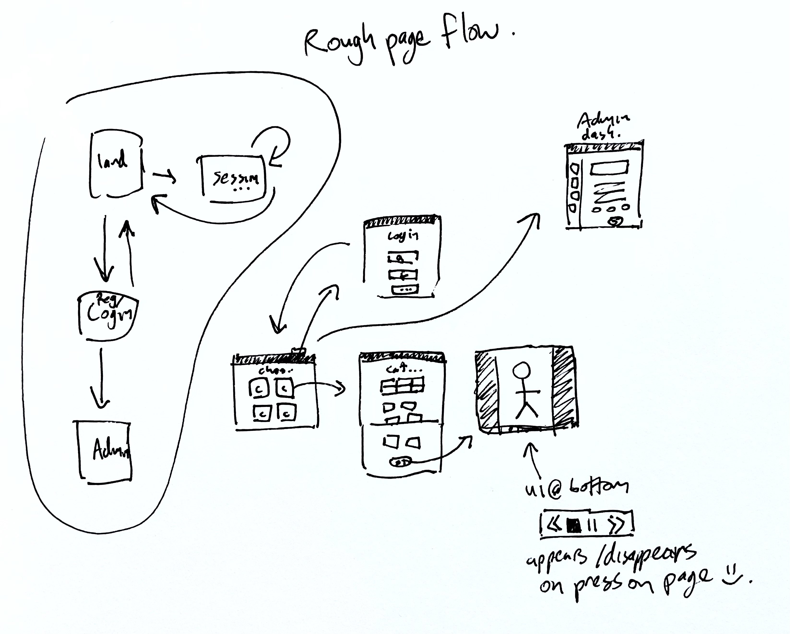
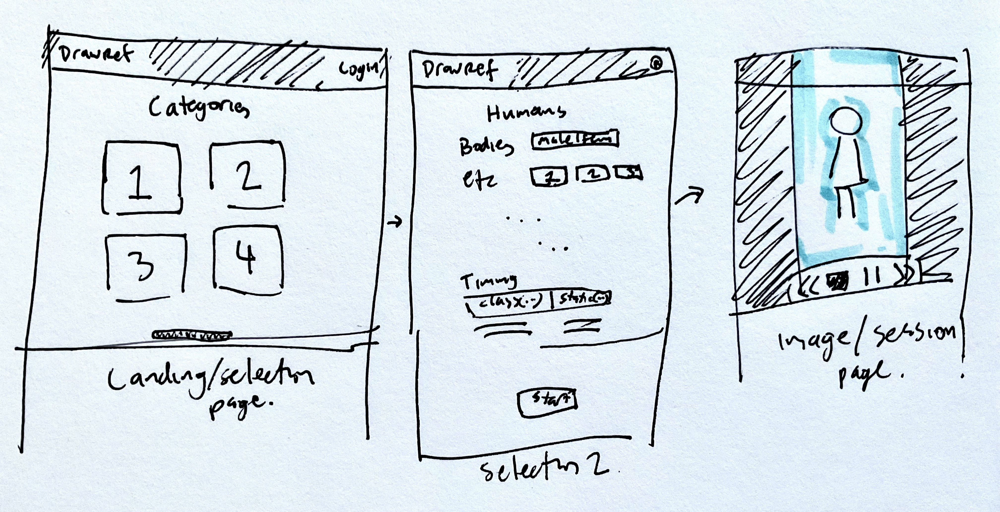
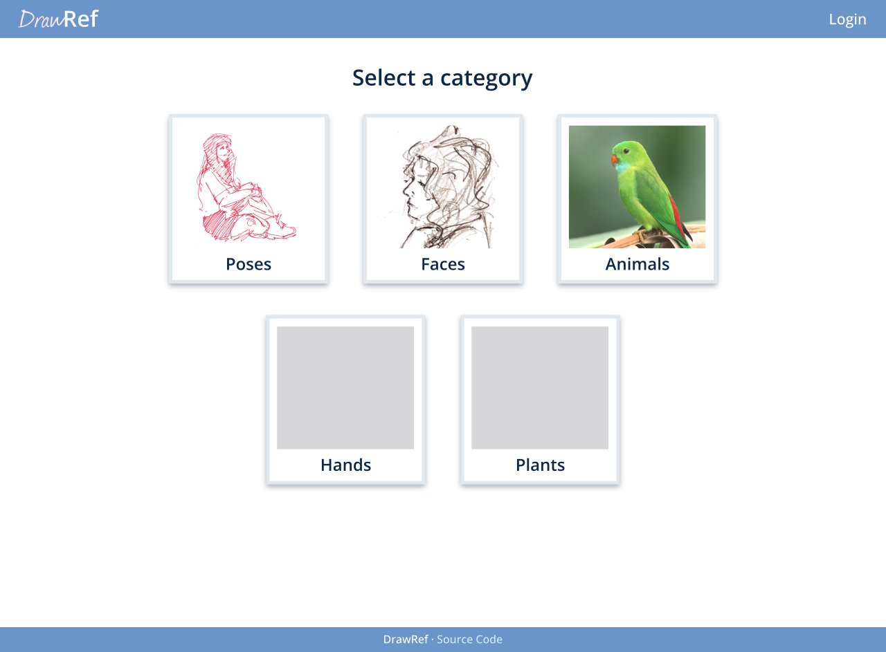
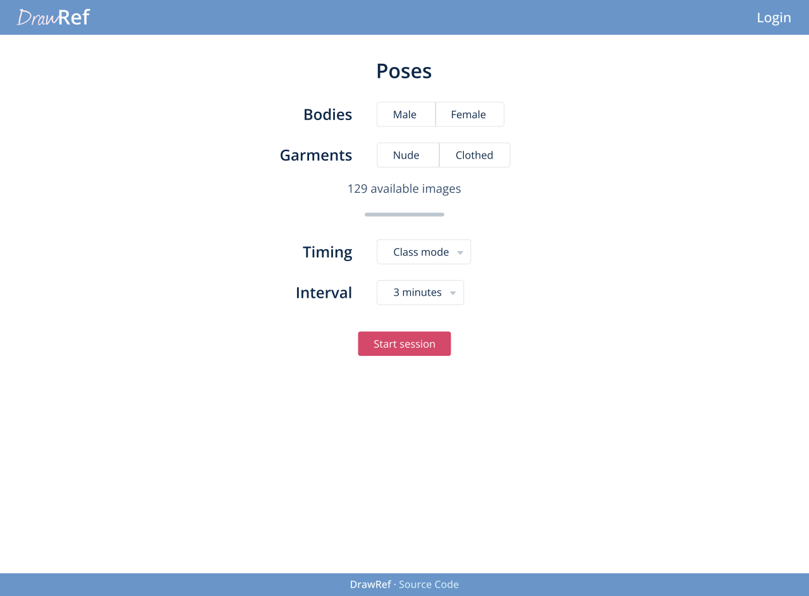
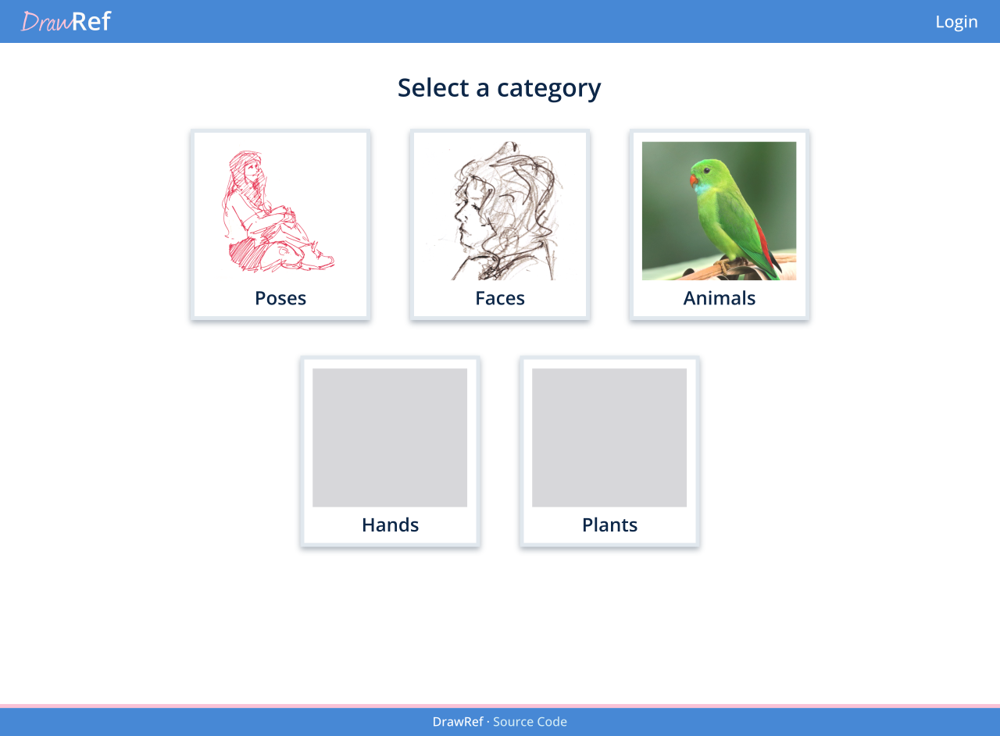
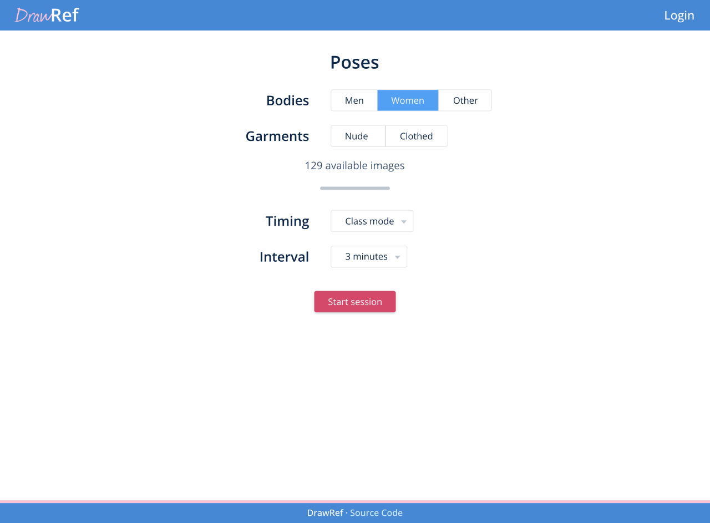
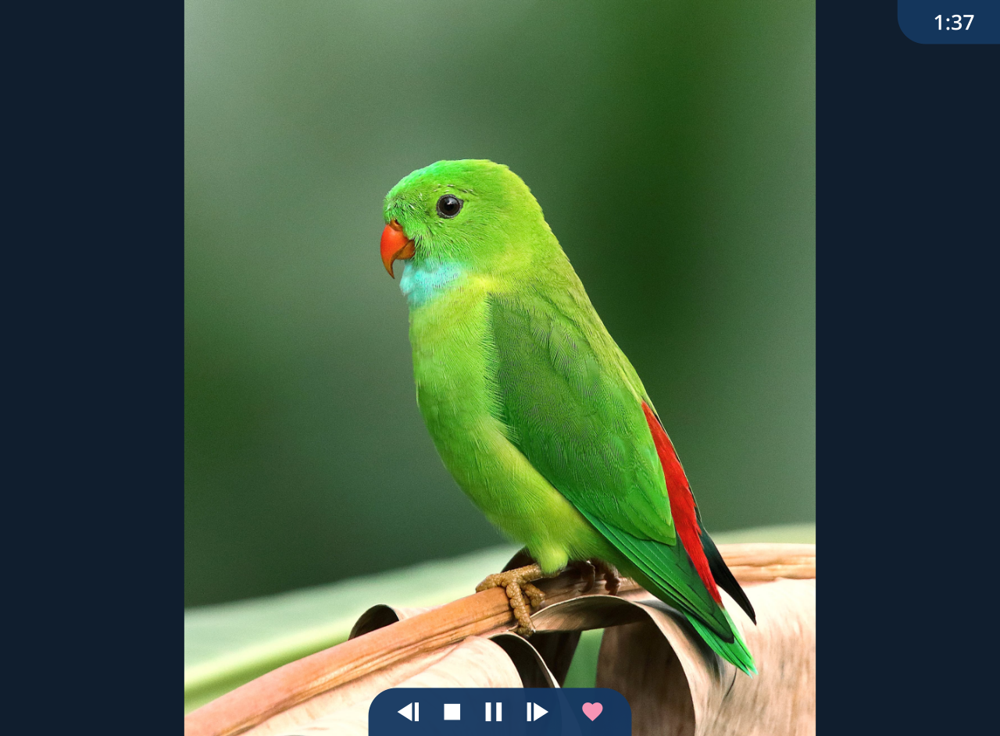
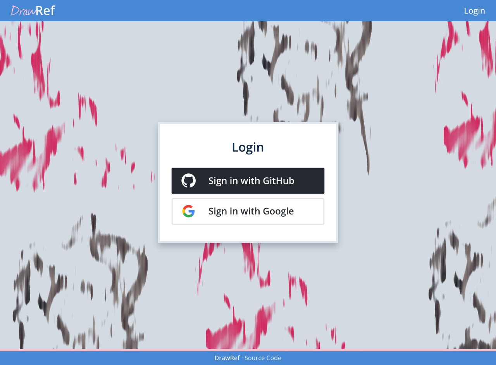
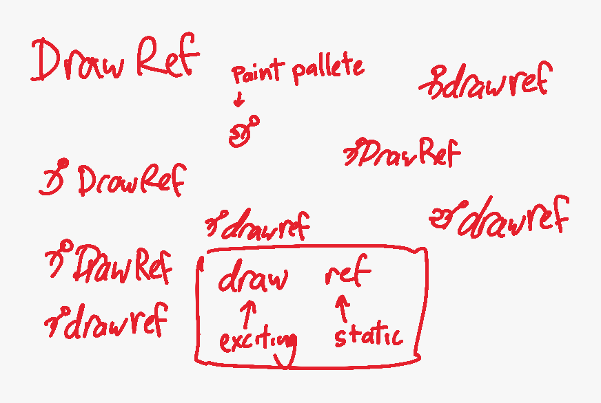

# DrawRef
This is a webapp that holds and presents images, for drawing reference. I'm building this app to learn how new backend and front-end technologies work.

Here's where we'll be doing the planning and all.

## Initial definitions

- **Audience:** Artists are the main users of this app.
  - **Tech-saviness:** Users won't be tech-savvy, keep it simple.
  - **Time spent on the app:** For every couple minutes on the selection side, maybe fourty minutes on the image presentation side.
  - **Environment:** The app likely won't be their main focus. They'll use it as a companion while drawing, off to the side. Could be on a mobile or desktop device.
- **Use:** Click on a category, and see images from that category presented in a format similar to a life-drawing session.
- **Technology:**
  - **Frontend:** React. Maybe TailwindCSS.
  - **Backend:** Express.js.
  - **Database:** Postgres.
  - **Login:** SSO with various services, not needed to access the site.

## Research

### Questions

Most of the answers are based on my expectations as an artist who uses these tools.

---

_What similar existing software/sites exist?_

- http://reference.sketchdaily.net
- https://line-of-action.com
- https://quickposes.com/en

---

_What functionality is expected?_

- Selecting a category of picture (human, hands, animals, vegetation, etc).
- Choosing one or more specific sub-categories within each (nude, clothed, avian, seated, etc).
- Choosing the interval that each picture's displayed for (10s, 30s, 2m, 60m, etc).
- Choosing the same interval for all pictures, or a session-like interval (start at a short amount of time per picture, slowly build up to half an hour or an hour per picture).
- Know where each picture comes from / having images be referenced appropriately.

---

_What pain points exist with the existing tools?_

- Can't add your own images or references.
- Class-like intervals are very useful, but not always supported.

### Audience

Admin users generally understand self-hosting, Docker images, importing content, and are tech-savvy.

Users are artists, may not be familiar with tech or the web, and are simply looking to draw with some references.

## Key features and functionality

- Admin
  - **Categories**
    - Create a category.
    - Edit the metadata for a category (nude/clothed, type of pose, type of animal, etc).
  - **Images**
    - Import one or more images from a local directory, with default credit/metadata.
    - Upload one or more images, with default credit/metadata.
    - Bulk edit the categories/metadata of images.
    - Bulk remove images from the site.
- User
  - **Authentication**
    - Register with SSO.
    - Login with SSO.
  - **Drawing session**
    - Select category and metadata, or favourites.
    - Select image intervals (including class-like session).
    - Start session.
    - Pause and resume session.
    - Favourite images.
  - **Misc**
    - See favourited images.

## Pages

MVP:
- Selection page: Select category, images, and timing. Is the landing page.
- Image page: Display the current image.
- Register/Login page: Login via SSO. Account is auto-created if it doesn't exist.
- Admin dashboard: Modify available categories and images.

Extra:
- Favourites page: Lists the user's favourite images.
- About page: Has info about the site and project.
- Credits page: Has info about where the images are from.

## API

### Upload API
The Upload API lets admins upload images, which returns temporary image IDs, which should then be provided in image upload/creation calls on the User API.

- `/image` `POST`: Upload an image.
- `/bulk/image` `POST`: Upload multiple images.

### User API
The User API lets you create and edit categories, upload images, and favourite images.

- Authentication
  - ... SSO login via OAuth? ...
- Categories
  - `/categories` `GET`: Get all categories.
  - `/category` `POST`: Create a category.
  - `/category/{id}` `GET/PUT/DELETE`: Get, edit, or delete a category.
- Images
  - `/image` `POST`: Upload an image.
  - `/image/{id}` `GET/PUT/DELETE`: Get, edit, or delete an image.
  - `/image/{id}/fave` `POST/DELETE`: Make this image a favourite, or un-favourite it.
  - `/bulk/images` `GET/POST/PUT/DELETE`: Bulk get/upload/edit/delete images.
  - `/fave/images` `GET`: Get all favourited images.

## Mockups

### Initial sketches

### Version 1

  
  

### Version 2

  
  
  
  

### Logo

